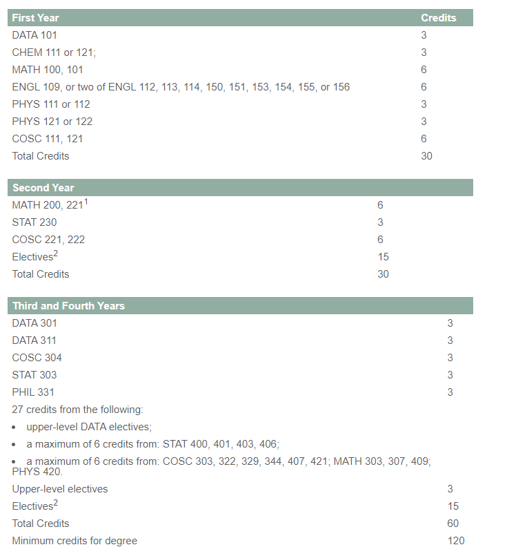

<!-- TODO: change vignette title -->

```{=html}
<script type="text/x-mathjax-config">
MathJax.Hub.Register.StartupHook("TeX Jax Ready",function () {
  MathJax.Hub.Insert(MathJax.InputJax.TeX.Definitions.macros,{
    cancel: ["Extension","cancel"],
    bcancel: ["Extension","cancel"],
    xcancel: ["Extension","cancel"],
    cancelto: ["Extension","cancel"]
  });
});
</script>
```
```{r, include = FALSE}
knitr::opts_chunk$set(
  collapse = TRUE,
  comment = "#>"
)
```

Introduced by [@heileman2018curricular], Curricular Analytics (CA)
introduces a framework that allows one to leverage complex network
analysis when investigating curricula structure relating the ease with
which a student progresses through a curriculum with its structural
complexity. The package CurricularAnalytics provides an implementation
of the CA framework for use in R. Through it one may construct and
visualize curriculum graphs and investigate various metrics such as

-   Blocking Factor
-   Delay Factor
-   Centrality
-   Structural Complexity

# Background

## Introduction

CA identifies two primary components when investigating the effect
curricula has on students as they complete a degree: *structural
complexity* and *instructional complexity*. Structural complexity has to
do with how courses are ordered in sequence and more specifically how
requisite relationships between course orderings impact student success.
Instructional complexity refers to the quality of instructors, support
resources, etc. CA postulates that the complexity of a given curriculum
$c$ will be a function of these two complexities:
$$\Psi_c = f(\alpha_c,\gamma_c)$$ where

-   $\gamma_c=g(\bar{x}_c)$ represents the instructional complexity
    which is itself a function of a vector $\bar{x}_c$ containing
    instructional factors.
-   $\alpha_c = h(\bar{y}_c)$ represents the structural complexity which
    is itself a function of a vector $\bar{y}_c$ containing structural
    factors.

CA's main emphasis is in approximating $\alpha_c$ and altering curricula
to minimize structural complexity. For more reading on CA and its
applications see [@heileman2018curricular].

# Metrics

## Notation

Curricula are represented as directed acyclic graphs (DAGs). Nodes
represent courses and directed edges exist between nodes that hold pre-
or co-requisite relationships. Mathematically, for a curriculum $c$ that
hold $n$ courses we construct a *curriculum graph* $G_c=(V,E)$ where
each $v \in V = \{v_1,\dots,v_n\}$ represents a course and a directed
edge $(v_i, v_j) \in E$ exists if course $v_i$ must be completed
previous or in conjunction with $v_j$. Note no distinction is made
between a co- and pre-requisites.

Paths in a curriculum graph will be denoted as follows: a path
$p \in G_c = (V,E)$ is written $v_i \overset{p}{\rightsquigarrow} v_j$
where $v_i,v_j \in V$. A path is simply a sequence of vertices
$\langle v_i,\dots,v_j \rangle$ where if $v_x$ comes before $v_y$ then
$(v_x,v_y) \in E$. Additionally,
$\#(v_i \overset{p}{\rightsquigarrow} v_j)$ is used to represent the
number of nodes on a path.

## Delay Factor

The delay factor of a course is the longest path the nodes finds itself
on. More formally the delay factor of a node $v_k$ is given by

$$d_c(v_k)=\underset{i,j,l,m}{max}\left\{\#\left(v_i \overset{p_l}{\rightsquigarrow} v_k \overset{p_m}{\rightsquigarrow} v_j \right)\right\}$$
The delay factor of an entire curriculum graph $G_c$ is defined as

$$d(G_c)=\sum_{v_k \in V}d_c(v_k)$$

## Blocking Factor

Blocking factor quantifies when a failing a course would result in being
blocked from registering for future courses. More formally the blocking
factor of a node $v_i$ is defined as

$$b_c(v_i) = \sum_{v_j \in V} I(v_i,v_j)$$ where $I$ is the indicator
function:

$$=\begin{cases}1, & \text{if } v_i \rightsquigarrow v_j \\ 0, & \text{if }v_i \cancel{\rightsquigarrow} v_j\end{cases}$$
The blocking factor for an entire curriculum graph $G_c$ is defined as

$$b(G_c)=\sum_{v_i \in V} b_c(v_i)$$

## Centrality

A course is considered central if it has many requisite edges flowing in
and out of the node. More formally it is the number of long paths that
include the node. That is, consider a curriculum graph \eqn{G_c} and a
vertex $v_i$. A long path is a path that satisfies the following
conditions:

-   $v_i,v_j,v_k$ are distinct
-   $v_j \rightsquigarrow v_i \rightsquigarrow v_k$
-   $v_j$ is a source node (in-degree zero)
-   $v_k$ is a sink node (out-degree zero)

Let $P_{v_i}=\{p_1,p_2,\dots\}$ denote the set of all paths defined as
above. Then the centrality of a node $v_i$ is given by

$$q(v_i)=\sum^{|P_{v_i}|}_{l=1}\#(p_l)$$ More plainly this is the number
of paths containing $v_i$ of at least length 3 where $v_i$ is neither
source nor sink node.

## Structural Complexity

The structural complexity of a node $v_k$ is defined as a linear
combination of the node's delay and blocking factors. More formally

$$h(v_k) = d(v_k) + b(v_k)$$ The structural complexity of an entire
curriculum graph $G_c$ is defined as

$$h(G_c)=d(G_c)+b(G_c)=\sum_{v_k \in V} \left(d_c(v_k) + b_c(v_k)\right)$$

# Example Analysis

The following analyses present how one may use CurricularAnalytics to
analyze university curricula and inform curriculum revision and
creation. The analysis is conducted on the Data Science (DS) curriculum
found at the University of British Columbia - Okanagan (UBCO). As Data
Science is a rapidly evolving discipline the program has gone through
many iterations with several major overhauls having been implemented in
the last five years. The analysis investigates the current 2022 and 2023
DS majors, the 2022 DS minor, and the proposal of a math stream in the
2022 DS major.

## 2022/2023 DS Major


:::: {style="display: flex;"}

::: {}
Within the final years of the DS program at uBCO students have a wide
selection of DS-related elective credits. The rational behind this being
that DS is a very broad field which allows students to acquire key core
skills in their first two and a half years and then proceed to focus on
subject areas that interest them the most.

The result, however, is an increase in the variability of curriculum
graphs. Therefore, we propose to investigate the maximally and minimally
structurally complex graphs. This allows the analyst to place upper and
lower bounds on the structural complexity and see how degree pathways
interact at the extremes. Additionally, we omit any general electives as we wish to examine the core structure of the curriculum graph.
:::

::: {}
{width="400"}
:::

::::

In CurricularAnalytics we store curriculum graphs in json files as suggested in [@hickman2017development]. One may construct these by hand or use curriculum_graph_to_json() after having made a graph using curriculum_graph_from_list(). 

```{r setup}
library(CurricularAnalytics)
C <- curriculum_graph_from_json("C:\\Users\\danie\\OneDrive\\Desktop\\CurricularAnalytics\\vignettes\\data\\DS-Major-2022-2023.json")
C$node_list


 edge_list <- data.frame(from = NA, to = NA)

  for (node in df$label) {
    str <- subset(df, label == node)$prerequisites[[1]]
    course_code <- ""
    if (!is.null(str)) {
      course_code <- str
    }

    from <- rownames(subset(df, label == node))
    to <- rownames(subset(df, label %in% course_code))
    if (length(to) > 1) {
      for (id in to) {
        edge_list <- rbind(edge_list, data.frame(from = id, to = from))
      }
    } else {
      edge_list <- rbind(edge_list, data.frame(from = to[1], to = from))
    }
  }
  edge_list <- stats::na.omit(edge_list)


# plot(C)
```

```{r}
file <- "C:\\Users\\danie\\OneDrive\\Desktop\\CurricularAnalytics\\vignettes\\data\\DS-Major-2022-2023.json"
 if (file.exists(file)) {
    file_extension <- tools::file_ext(file)
    if (file_extension != "json") {
      stop("File exists but is not a JSON file.")
    }
  } else {
    stop("File does not exist or cannot be found.")
  }

  file <- jsonlite::fromJSON(file)
  json_data <- jsonlite::fromJSON(file)
  df <- json_data$courses
  node_list <-
    data.frame(id = as.numeric(rownames(df)), label = df$label, term = df$term)

  edge_list <- data.frame(from = NA, to = NA)

  for (node in df$name) {
    str <- subset(df, name == node)$prerequisites[[1]]
    course_code <- ""
    if (!is.null(str)) {
      course_code <- str
    }

    from <- rownames(subset(df, name == node))
    to <- rownames(subset(df, name %in% course_code))
    if (length(to) > 1) {
      for (id in to) {
        edge_list <- rbind(edge_list, data.frame(from = id, to = from))
      }
    } else {
      edge_list <- rbind(edge_list, data.frame(from = to[1], to = from))
    }
  }
  edge_list <- stats::na.omit(edge_list)
```


# Conclusion

# References
